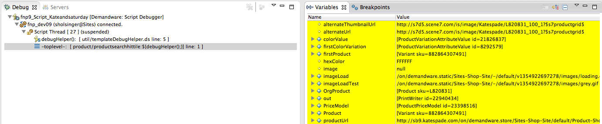

# demandware-template-debugger
An instructional repository for techniques used in debugging Demandware templates.

# Usage #
First, make sure that the TemplateDebugger.ds file is included in the template. This can be done within its own `<isscript/>` block, or an existing one. Keep in mind that the include needs to be present before the `TemplateDebugger.debug()` method can be utilized. Therefore, it is recommended that a dedicated `<isscript/>` block be used, and placed at the top of the ISML file. It is important to delete these elements once done debugging, to avoid null reference errors or performance issues in production environments.

    <iscomment><!-- DELETE AFTER USE: V !!!! --></iscomment>
    <isscript>var TemplateDebugger = require('int_dev_suite/cartridge/scripts/util/TemplateDebugger.ds');</isscript>
    <iscomment><!-- DELETE AFTER USE: ^ !!!! --></iscomment>

Once the TemplateDebugger.ds file is included, place a `TemplateDebugger.debug()` call in any existing `<isscript/>` bock, or create a dedicated `<isscript/>` block. Any variable, either in an `<isscript/>` block, or an `<isset/>` declaration, that was present before the `TemplateDebugger.debug()` call will be visible.

Multiple `TemplateDebugger.debug()` calls may be required. You need one call for each individual breakpoint needed.

    <iscomment><!-- DELETE AFTER USE: V !!!! --></iscomment>
    <isscript>TemplateDebugger.debug();</isscript>
    <iscomment><!-- DELETE AFTER USE: ^ !!!! --></iscomment>

Once the required tags are in place, add a script debug breakpoint to the line with the `return` statement of the `exports.debug()` method. Run the script debugger, and navigate to the correct pipeline which will render the ISML file being debugged.

# Viewing the variables in your template #
Within the "Debug View" window, it will list the active breakpoint. From there, click the, "-toplevel-" thread. Doing so will open the Template's thread, at which point, the template variables are visible in the "Variables View" window.

# Authors & Contributors

* Steve Holsinger (@sholsinger) - Original author ([see original](https://www.evernote.com/shard/s61/sh/524210c5-3830-4681-8fe2-0af02f881e7d/b986e34e00b62ddb))
* Ethan Gaudette (@egaudette)

# Contributing
Simply submit a pull request. We also welcome issues to be entered by the community if you are unable to address the issue yourself.
